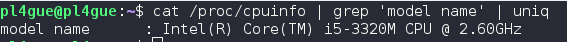
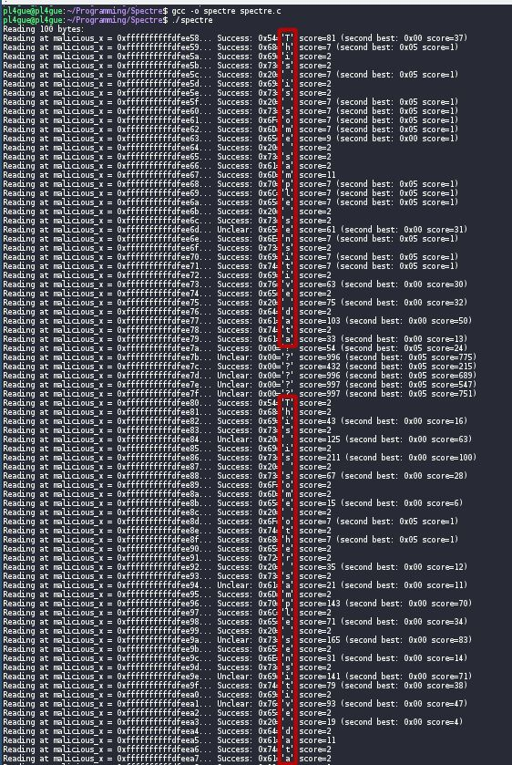
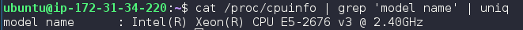
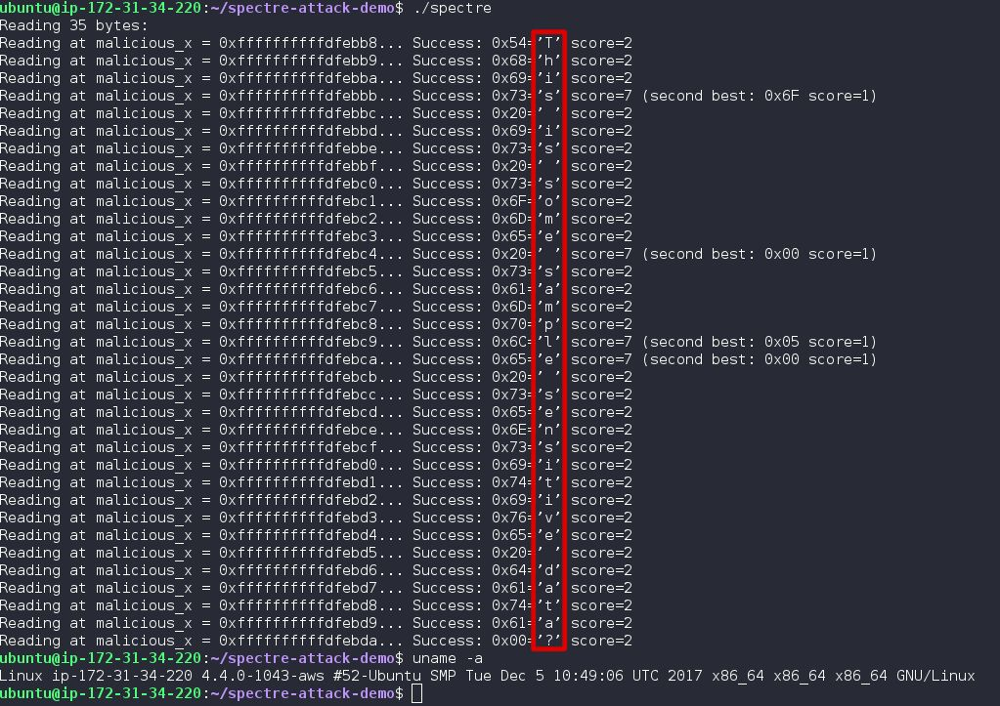

# Spectre Attack Demo (i5-3320M and Intel Xeon v3)
This shows a Proof of Concept Exploit demonstrating the [Spectre](https://spectreattack.com/) attack. Credit for this work goes to: https://github.com/flxwu/spectre-attack-demo

## Exploiting Speculative Execution
According to the Spectre paper,
> Spectre attacks trick
the processor into speculatively executing instructions
sequences that should not have executed during correct
program execution

The two secrets are declared here:
```c
char * secret = "This is some sample sensitive data";
char * secret2= "This is some other sample sensitive data";
```

This was run on a **local laptop running an Intel i5-3320M on Ubuntu 16.10 Yaketty**



and it worked, as seen here:



Then, it was run on a **AWS EC2 Instance running an Intel Xeon E5-2676 v3 on Ubuntu Server 16.04TLS**



and it worked as well:



### Credits
Spectre was independently discovered and reported by [Jann Horn](https://twitter.com/tehjh) and [Paul Kocher](https://paulkocher.com/) in collaboration with, [Daniel Genkin](https://www.cis.upenn.edu/~danielg3/) (University of Pennsylvania and University of Maryland), [Mike Hamburg](https://www.shiftleft.org/) (Rambus), [Moritz Lipp](https://mlq.me/) (Graz University of Technology), and [Yuval Yarom](https://cs.adelaide.edu.au/~yval) (University of Adelaide and Data61).

#### Their work is documented in the [Spectre Paper](https://spectreattack.com/spectre.pdf).
